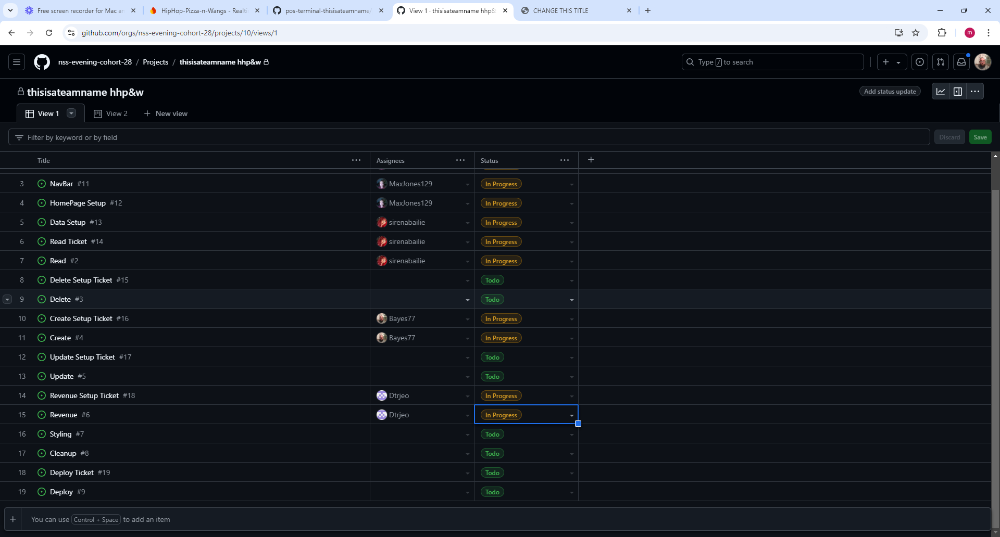
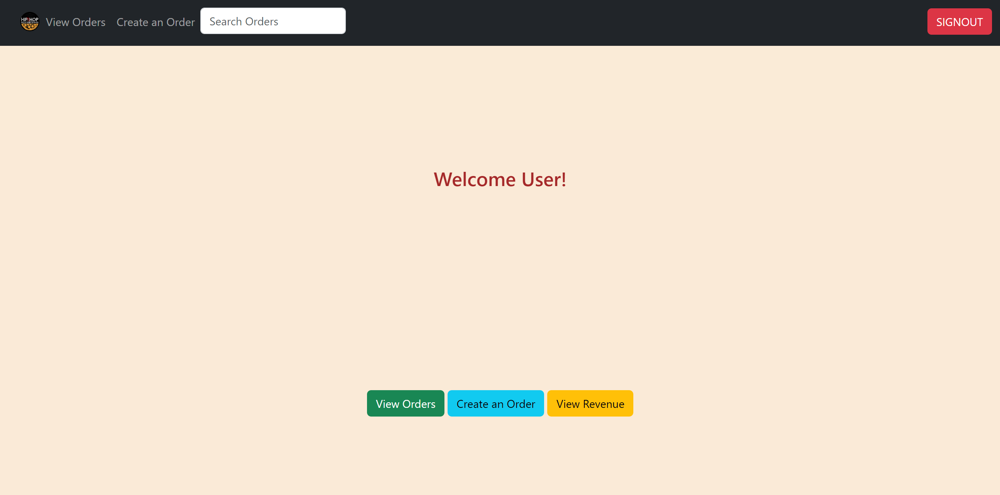
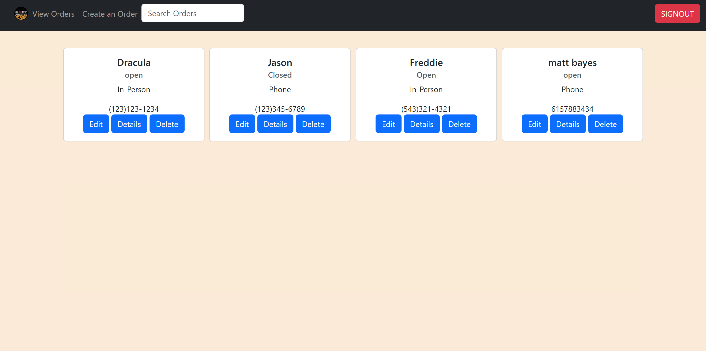
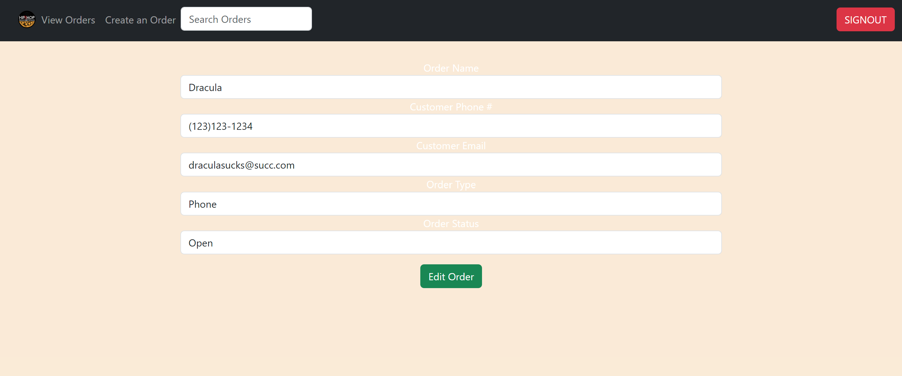
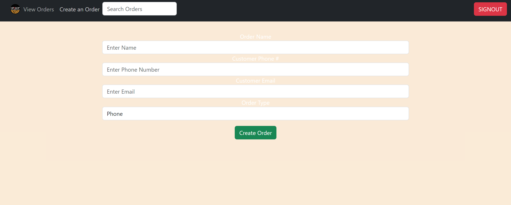
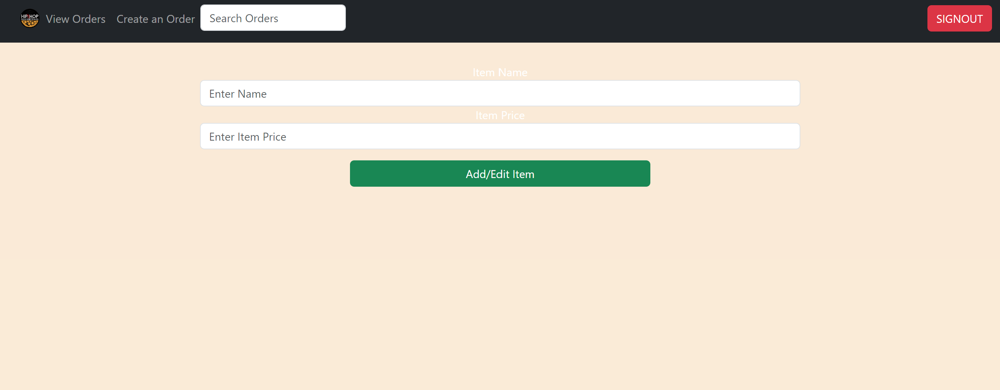

# HipHop Pizza n Wangs

## Overview
This app is a POS that allows restaurant owners to keep track of, create, and update items/orders.

## Wireframe
[Wireframe](https://www.figma.com/design/4y3EZddALuBR3ouSEM57Np/MVP?node-id=0-1&node-type=canvas&t=sNaqoi6ohs28JMhP-0)

## Flowchart

## Deployed Project
TBD

## Project Board

## User Description
Ideal user would be someone that would benefit from an organized POS system.

## Features
- Google User Authentication
- Welcome page with the option to 'View Orders', 'Create Orders', and 'View Revenue'
- Navbar fearuring 'View Orders' and 'Create an Order'
- Orders have option to edit, view details, or delete
- Order details page shows all items and total of those items
- Items have create and delete options 
- Form to create item
- Form to create orders
- Revenue page

## Screenshots

## Contributors 
[Sirena Foster](https://github.com/sirenabailie)
[David Trejo](https://github.com/Dtrjeo)
[Max Jones](https://github.com/MaxJones129)
[Matthew Bayes](https://github.com/Bayes77)

## Loom Video
TBD
